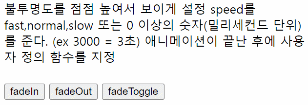
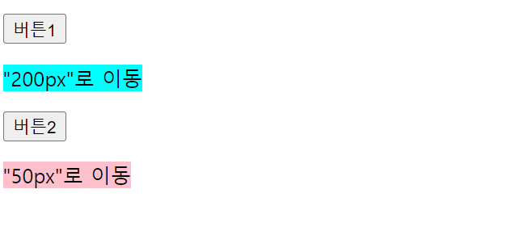

# slideUp, slideDown, slideToggle

선택한 요소에 대해 슬라이드 형태로 나타나거나 사라지게 해주는 메서드를 말한다.
`slideUp()`, `slideDown()`의 경우 한번 메서드를 실행시킨 요소에 대해서는 재적용할 수 없으나 `slideToggle()`의 경우 **메서드를 실행시킬 때마다 slideUp, slideDown 효과가 반복**되어 나타난다. 이는 밑에 나올 `fadeToggle()` 에도 똑같이 적용된다.

```html
<script>
$(function(){
	//1.slideup
	$('#slideup').click(function(){
		//형식 $('선택자').slideUp() or slideUp(유지시간,함수)
		$('div').slideUp();
	})
	//2.slidedown
	$('#slidedown').click(function(){
		//형식 $('선택자').slideDown() or slideDown(유지시간,초,문자열(slow,fast))
		$('div').slideDown();
	})
	//3.slideToggle
	$('#slideToggle').click(function(){
		//형식 $('선택자').slideUp() or slideUp(유지시간,함수)
		$('div').slideToggle(3000);
	})
})
</script>
```


따라서 `slideUp()`과 `slideDown()`을 번갈아가며 실행시키면 다음과 같은 모습이 된다.

# fadeIn, fadeOut, fadeToggle


선택한 요소를 흐려지게 하여 숨기거나(fade in), 숨겨진 요소가 점차 선명해져 나타나게 해주는(fade out) 메서드를 말한다.
```html
<script>
$(function(){
	//1.fadeIn->서서히 화면이 보이는 경우
	$('#fadeIn').click(function(){
		//형식)$('선택자').fadeIn(애니메이션 유지시간->함수 호출)
		$('div').fadeIn(1000,function(){//div태그를 3초동안 서서히 보여준 뒤
			$('span').fadeIn(100);//0.1
		})
	})
	//2.fadeOut->불투명도 감소->서서히 사라짐(투명도)
	$('#fadeOut').click(function(){
		//형식)$('선택자').fadeOut(애니메이션 유지시간->함수 호출)
		$('div').fadeOut(1000,function(){//div태그가 3초동안 서서히 사라진 뒤
			$('span').fadeIn(100);//div태그가 서서히 사라질 때까지는 보여야 하기 때문에
		})
	})
		
	//3.fadeToggle->fadeIn,fadeOut을 번갈아 가면서 화면에 출력
	$('#fadeToggle').click(function(){
		//형식)$('선택자').fadeOut(애니메이션 유지시간->함수 호출)
		$('div').fadeToggle(1000,function(){
			$('span').fadeIn();
		})
	})
})
</script>
```

# animate
선택한 요소에 다양한 효과(날아가기, 작아지거나 커지기 등)를 적용 시킬 수 있다.


**형식** $('효과대상자').animate({스타일속성},유지시간,가속도,콜백함수)  
```html
<script>
$(function(){
	$('.btn1').on('click',function(){
		$('.txt1').animate({
			marginLeft:"200px", fontSize:"30px"},1000,
			"swing",function(){
 			alert("모션효과1 종료!!");
		})//animate함수
	})//on함수
		
	$('.btn2').on('click',function(){
		$('.txt2').animate({marginLeft:"50px", fontSize:"10px"
		},1000,"linear",function(){
 			alert("모션효과2 종료!!"); 
		})//animate함수
	})
})
</script>
```