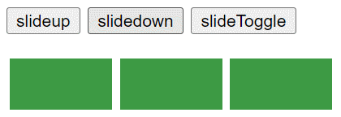

# slideUp, slideDown, slideToggle

선택한 요소에 대해 슬라이드 형태로 나타나거나 사라지게 해주는 메서드를 말한다.
`slideUp()`, `slideDown()`의 경우 한번 메서드를 실행시킨 요소에 대해서는 재적용할 수 없으나 `slideToggle()`의 경우 **메서드를 실행시킬 때마다 slideUp, slideDown 효과가 반복**되어 나타난다. 이는 밑에 나올 `fadeToggle()` 에도 똑같이 적용된다.

```html
<script>
$(function(){
	//1.slideup
	$('#slideup').click(function(){
		//형식 $('선택자').slideUp() or slideUp(유지시간,함수)
		$('div').slideUp();
	})
	//2.slidedown
	$('#slidedown').click(function(){
		//형식 $('선택자').slideDown() or slideDown(유지시간,초,문자열(slow,fast))
		$('div').slideDown();
	})
	//3.slideToggle
	$('#slideToggle').click(function(){
		//형식 $('선택자').slideUp() or slideUp(유지시간,함수)
		$('div').slideToggle(3000);
	})
})
</script>
```

따라서 `slideUp()`과 `slideDown()`을 번갈아가며 실행시키면 다음과 같은 모습이 된다.

# fadeUp, fadeDown, fadeToggle

선택한 요소를 흐려지게 하거나 선명하게 해주는 메서드를 